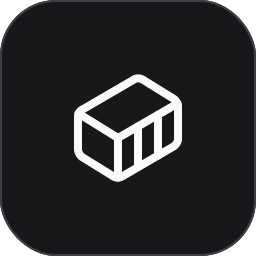
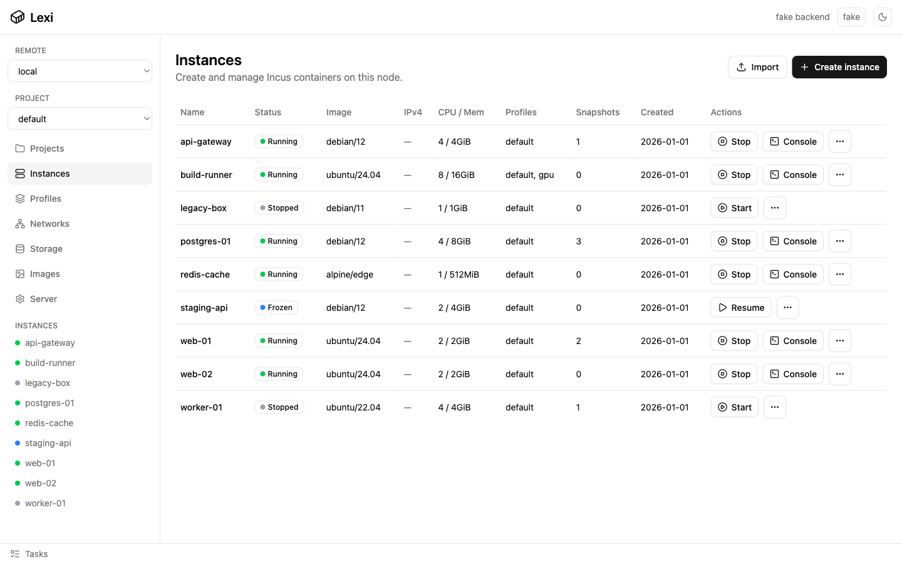
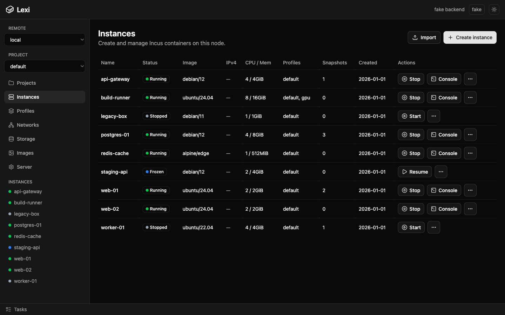
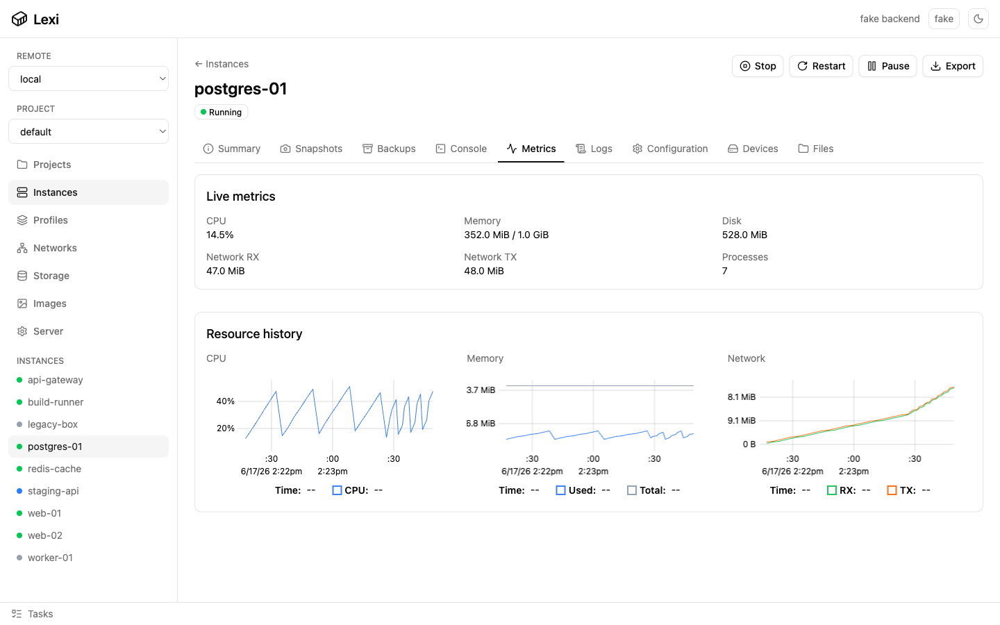
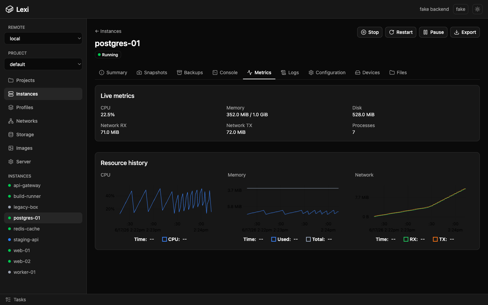

<div align="center">



# Lexi

**Proxmox-style LXC container management without the Proxmox overhead**

A lean, single-binary control plane for [Incus](https://linuxcontainers.org/incus/) that runs on _your_ distro.

[](LICENSE)  

</div>

---

Lexi is a single static Go binary + server-rendered web UI for managing
[Incus](https://linuxcontainers.org/incus/) LXC containers on one node:
list · create-from-image · start/stop · snapshot · clone · delete.

CSS, JS, and templates are embedded in the binary — nothing else to deploy.

## Screenshots

<table>
  <tr>
    <td width="50%"></td>
    <td width="50%"></td>
  </tr>
  <tr>
    <td align="center"><em>Instances dashboard — light</em></td>
    <td align="center"><em>Instances dashboard — dark</em></td>
  </tr>
  <tr>
    <td width="50%"></td>
    <td width="50%"></td>
  </tr>
  <tr>
    <td align="center"><em>Live metrics — light</em></td>
    <td align="center"><em>Live metrics — dark</em></td>
  </tr>
</table>

## Status

v1 vertical slice (Incus tier, web UI) — under active development.

## Prerequisites

- **Go 1.26+**
- **Incus** reachable via the `incus` CLI (the daemon `lexi` talks to). It uses
  your `incus` client config and current remote, so if `incus list` works,
  `lexi` works.
- Dev only: [`templ`](https://templ.guide) and the Tailwind v4 CLI. `templ`:
  `go install github.com/a-h/templ/cmd/templ@latest`. Tailwind is auto-located
  (vendored `./bin/tailwindcss`, one on `PATH`, or `npx @tailwindcss/cli`).

## Install

Linux release binaries are published for `amd64` and `arm64`:

```bash
curl -fsSL https://github.com/lexihq/lexi/releases/latest/download/install.sh | sh
lexi
```

Set `LEXI_VERSION=vX.Y.Z` to install a specific tag. The installer places
`lexi` in `/usr/local/bin` by default; override with `INSTALL_DIR=/path`.

## Develop

```bash
./scripts/dev.sh        # templ + tailwind watch, live reload on :8080
```

## Build

```bash
./scripts/build.sh      # -> ./lexi (single self-contained binary)
./lexi                 # serves http://localhost:8080
```

## Release

```bash
./scripts/release.sh    # -> dist/lexi-linux-amd64 and dist/lexi-linux-arm64
```

Tagged pushes (`v*`) publish the two Linux binaries plus `install.sh` through the
GitHub release workflow.

By default lexi listens on `127.0.0.1:8080`. Passing `-addr :8080` exposes the
unauthenticated control plane to the network and should only be done on a
trusted, access-controlled network.

## Test

```bash
go test ./...                                   # fast unit tests, no daemon
go test -tags integration ./internal/backend/incus -v   # against your Incus remote
```

## Tech stack

Go · [`incus/v6/client`](https://pkg.go.dev/github.com/lxc/incus/v6/client) ·
[templ](https://templ.guide) · [templui](https://templui.io) (Tailwind v4) ·
[HTMX](https://htmx.org) · std-lib `net/http`.

## License

Lexi is source-available under the
[PolyForm Noncommercial License 1.0.0](LICENSE): free for any noncommercial
use (personal, research, education, non-profits, government). Commercial use
requires a separate license — open an issue or reach out.
